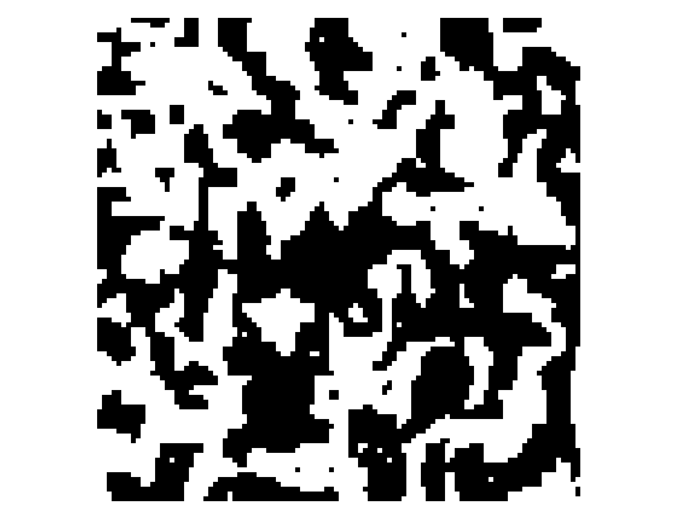

# Ising model simulation by Metropolis method
  
| $`x<em>{i}`$ | $x_j$ | energy |
| --- | --- | --- |
| 0 | 0 | 0 |
| 0 | 1 | 1 |
| 1 | 0 | 1 |
| 1 | 1 | 0 |

  
| $x_i$ | $x_j$ | energy |
| --- | --- | --- |
| 0 | 0 | 0 |
| 0 | 1 | 1 |
| 1 | 0 | 0 |
| 1 | 1 | 0 |

Run by `cargo run --release`.
